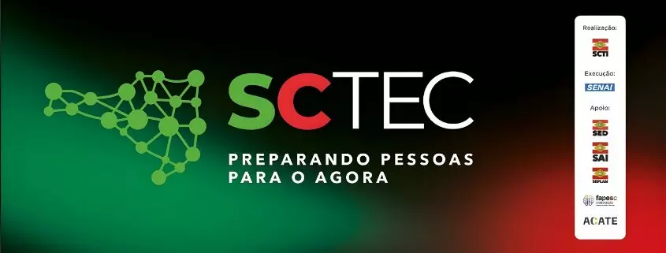

<div align="center">
  
  <h1>Sistema de Gestão de Empreendimentos Catarinenses</h1>

  
  
  
  
  
  
  
  
</div>

## 📖 Descrição da Solução
Esta aplicação é um protótipo de sistema CRUD (Create, Read, Update, Delete) desenvolvido para apoiar a organização e manutenção de dados sobre o ecossistema empreendedor de Santa Catarina. A solução permite gerenciar informações cruciais sobre empresas e seus responsáveis, categorizando-as por segmentos de atuação e municípios do estado.

O projeto foi construído com foco em **alta disponibilidade, escalabilidade e manutenibilidade**, utilizando uma arquitetura robusta baseada em camadas e seguindo as melhores práticas de desenvolvimento de software moderno.

## 🎥 Vídeo Pitch
Assista à demonstração do sistema e explicação técnica:
em breve

## 🛠️ Tecnologias Utilizadas
A stack tecnológica foi selecionada para garantir uma solução de nível empresarial:

| Categoria | Tecnologia | Justificativa Técnica |
| --- | --- | --- |
| **Linguagem** | Java 21 | Utilização de recursos modernos como *Records* para DTOs e melhorias de performance da JVM. |
| **Framework** | Spring Boot 3 | Agilidade no desenvolvimento de microsserviços e ecossistema robusto para APIs REST. |
| **Persistência** | Hibernate / JPA | Implementação do mapeamento objeto-relacional (ORM) para garantir a integridade dos dados. |
| **Banco de Dados** | PostgreSQL | Escolha de um banco relacional robusto para garantir a persistência segura das informações. |
| **Containerização**| Docker / Compose | Garante a portabilidade e a paridade entre os ambientes de desenvolvimento e execução. |
| **Gerenciador** | Apache Maven | Automação do build e gerenciamento eficiente de dependências do projeto. |
| **Documentação** | Swagger (OpenAPI)| Geração de interface interativa para testes e documentação dos endpoints da API. |
| **Produtividade** | Lombok | Redução de código *boilerplate*, focando na clareza e manutenção das entidades. |
| **Validação** | Jakarta Validation | Aplicação de regras de negócio e validação de dados diretamente na camada de entrada (DTOs). |

---

## 🏗️ Estrutura Geral do Projeto
A aplicação foi desenvolvida seguindo o padrão de camadas para garantir a separação de responsabilidades e facilitar a manutenção e evolução do sistema.

| Camada | Responsabilidade | Descrição Técnica |
| --- | --- | --- |
| **Controller** | Exposição de Endpoints | Gerencia as requisições HTTP, mapeia os endpoints REST e integra a documentação Swagger/OpenAPI. |
| **Service** | Regras de Negócio | Camada de serviço onde reside a lógica principal da aplicação e a orquestração de chamadas. |
| **Validator** | Validação Lógica | Componente desacoplado para validações de integridade (ex: garantia de unicidade de e-mails). |
| **Mapper** | Conversão de Dados | Responsável pela transformação entre Entidades e DTOs, garantindo o desacoplamento das camadas. |
| **Repository** | Persistência de Dados | Interface de abstração para operações de banco de dados utilizando Spring Data JPA. |
| **Entity/Domain** | Mapeamento Relacional | Classes que representam as tabelas do banco de dados e suas restrições de integridade. |
| **DTO** | Data Transfer Object | Objetos para tráfego seguro de dados entre camadas, evitando a exposição de entidades internas. |
| **Exception Handler**| Tratamento Global | Interceptador de exceções que padroniza as respostas de erro da API em formato JSON amigável. |
---

## ⚙️ Instruções de Execução

### Pré-requisitos
* Docker e Docker Compose instalados.

### Passo a Passo
1.  Clone o repositório:
    ```bash
    git clone https://github.com/nicholas-sc-08/sc-empreende-api.git
    cd sc-empreende-api
    ```
2.  Suba os containers (API + Banco de Dados):
    ```bash
    docker-compose up -d --build
    ```
3.  A aplicação estará disponível em: `http://localhost:8080`
4.  Acesse a documentação interativa (Swagger) para testar os endpoints:
    `http://localhost:8080/swagger-ui/index.html`

## 💡 Decisões Técnicas e Diferenciais
Para atender aos critérios de **Qualidade de Código (Peso 40%)**, foram implementados:
* **UUID:** Utilizado como chave primária para garantir segurança e evitar a exposição sequencial de IDs no banco.
* **Global Exception Handler:** Centralização do tratamento de erros (404, 400, 409) para evitar vazamento de Stack Traces e melhorar a experiência do desenvolvedor front-end.
* **Validation Logic:** Uso de validações customizadas para garantir que o e-mail de um empreendimento seja único no sistema.
* **Soft Delete/Status Toggle:** Implementação de lógica para alternar o status do empreendimento (Ativo/Inativo) via PATCH, seguindo a semântica correta do protocolo HTTP.

---